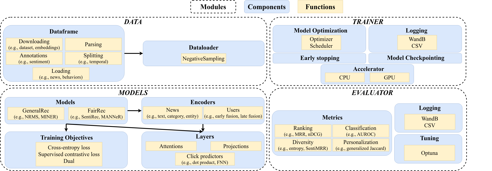

Introduction
============

NewsRecLib is a library based on `PyTorch Lightning <https://lightning.ai/docs/pytorch/stable/>`_
and `Hydra <https://hydra.cc/>`_
for the development and evaluation of neural news recommenders (NNR).
The framework is highly configurable and modularized,
decoupling core model components from one another. It enables running experiments from
a single configuration file that navigates the pipeline from dataset selection and loading
to model evaluation.
NewsRecLib provides implementations of several neural news recommenders,
training methods, standard evaluation benchmarks, hypeparameter optimization algorithms,
extensive logging functionalities, and evaluation metrics
(ranging from accuracy-based to beyond accuracy performance evaluation).

The foremost goals of NewsRecLib are to promote *reproducible research* and
*rigorous experimental evaluation*.

   NewsRecLib's schema
